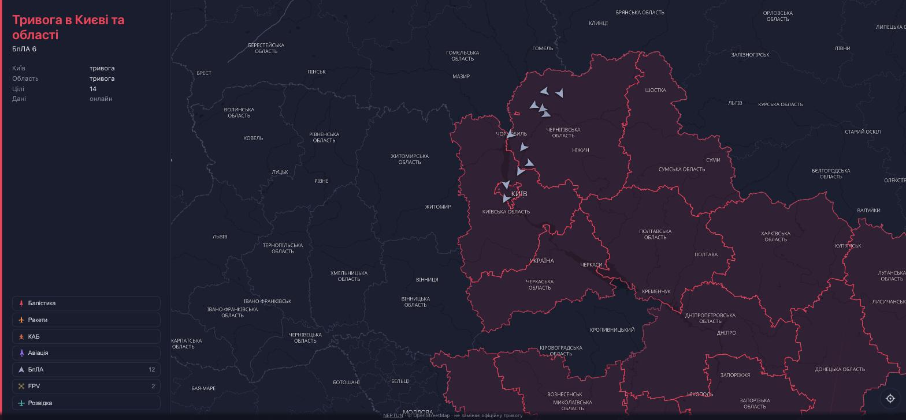

# Air Raid

A live map of air targets over Ukraine, built to answer one question from a phone at
night: **is anything ballistic heading for Kyiv, and what else is up there.**

Runs at [airraid.pp.ua](https://airraid.pp.ua). Saved to an iPhone home screen it opens as
an app, without browser chrome.



## What it shows

The status panel answers two independent questions, one line each, and never mixes them.

| Line | Question | Values |
|---|---|---|
| First | Is there an air-raid alert, and where | `Тривог немає` (green) · `Тривога в Києві` / `в Київській області` / `в Києві та області` (red) |
| Second | Is any of it ballistic, and what is up there | `Балістика на Київ` (red, pulsing) · `Загроза балістики` (yellow) · otherwise the composition over Kyiv in white, e.g. `Ракети 1 · БпЛА 5` |

The second line lists **only what is over Kyiv and Kyiv oblast**, ordered by severity
rather than by count — one missile matters more than twenty drones, and the eye reads the
start of a line. Neptun reports a region for most tracks; for the fifth or so that arrive
without one, the point is tested against the city and oblast boundaries the map already
loads.

When nothing is over the city the line is hidden rather than saying "nothing is flying".
Coverage has gaps, and an empty sky is not something this page can promise.

Below, a map draws every track with a silhouette per class, oriented to its heading and
moved between updates by dead reckoning at a per-class reference speed. Tapping a class in
the legend hides it — FPV drones fly a few kilometres near the line of contact and can
never reach Kyiv, which is why they have their own row rather than sharing the drone one.

## Data

| Source | What it provides |
|---|---|
| [neptun.in.ua](https://neptun.in.ua/) | live tracks over a WebSocket, with a REST snapshot as fallback |
| [OpenFreeMap](https://openfreemap.org/) | vector map tiles, no key, no quota |
| OpenStreetMap | the map data behind those tiles |
| `live/status.json` | ballistic verdict, written by a separate alert daemon that is not part of this repository |

Without that last file the page still works in full — only the status panel says the
verdict is unavailable, which is the honest answer rather than a green "no threat".

**This does not replace the official air-raid alert.**

## Layout

```
web/                the page - no build step, no bundler, no framework
  index.html        markup and the iOS home-screen tags
  app.js            feed, dead reckoning, icons, status panel
  style.css         dark theme, phone and desktop layouts
  map-style.json    MapLibre style, generated, recoloured to the dark navy palette
  maplibre-gl.*     vendored so the page does not depend on a CDN
  oblasts.geojson   oblast boundaries: alert shading, oblast names, and deciding whether
                    a track that arrived without a region is over Kyiv
  ukraine-mask.geojson  the world with Ukraine as a hole, generated - dims everything
                    outside the country
docker-compose.yml  the container that serves it
nginx.conf          gzip, cache policy, MIME types the browser insists on
tools/              asset generators and the integrity checker
```

There is deliberately no bundler. One file the browser reads directly is far easier to
debug on a phone at three in the morning than a sourcemap.

## Running it

```sh
docker compose -p airraid up -d
```

Two things in that file assume a particular deployment. The `edge` network is how a
reverse proxy in front reaches the container — drop it and publish a port instead. And
`STATUS_DIR` points at wherever the alert daemon writes `status.json`; leave it unset and
the page runs standalone, reporting that the ballistic verdict is unavailable.

## Checks

```sh
python3 tools/check_web.py
```

The page has no test suite — it has three failure modes that are silent, and this covers
them: a `?v=` cache-busting hash that no longer matches its file (assets are cached for a
week, so a fix can ship and stay invisible), a reference to an asset that no longer
exists, and malformed JSON that only fails in the browser. CI runs this on every push
alongside a syntax check of `app.js`.

## Regenerating assets

```sh
python3 tools/make_map_style.py     # fetch the upstream style and recolour it
python3 tools/make_icons.py         # render the PWA icon set
python3 tools/make_mask.py          # union the oblasts into the outside-Ukraine mask
```

`make_mask.py` needs `shapely`; nothing at runtime does.

After changing anything under `web/`, update its `?v=` hash to the first eight characters
of the file's SHA-1 — in `index.html` for the script and stylesheet, and in `app.js` for
`map-style.json`, `oblasts.geojson` and `ukraine-mask.geojson`, which the page fetches
itself. `check_web.py` checks both places and will tell you if you forget. It is worth
forgetting once to see why: nginx caches these for a day, so the fix ships and stays
invisible.
